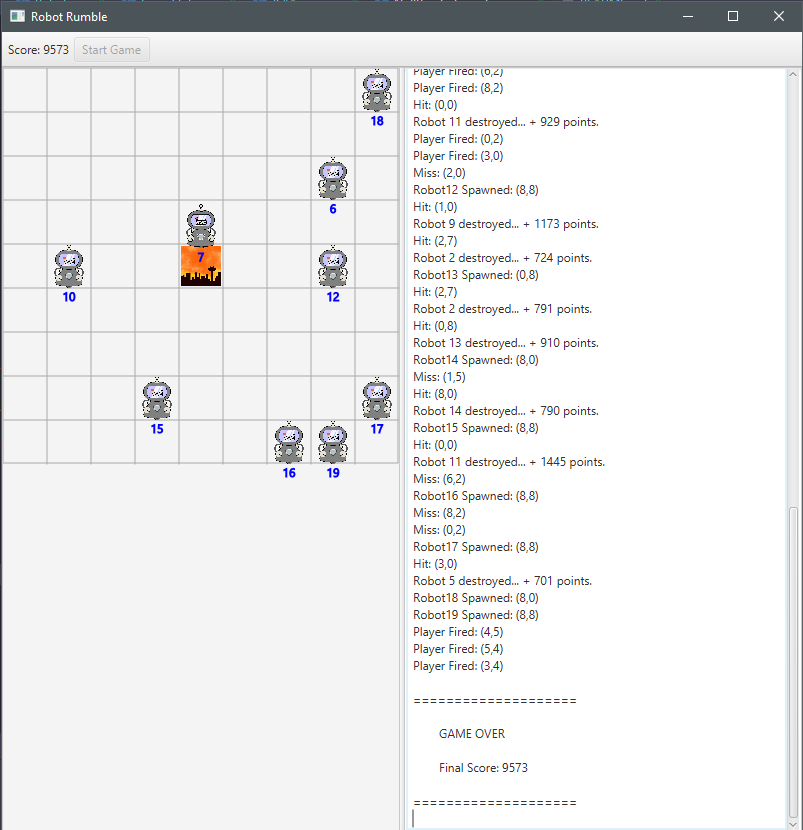

# Robot Rumble

A small game designed for *Software Engineering Concepts* Sem2 2020 at Curtin University

Used to demonstrate multithreading functionality.

To build and run simply clone the repo, and then from within the root Robot Rumble directory run:

`./gradlew run`

---

***Specifications:*** 

Robots spawn every 2 seconds in an empty map corner.

Each robot moves independently at speed (d), d is determined on robot creation and is random.

Robots will not bump into each other, and are aware of each others positions.

The player can fire at a grid cell by clicking on it, this queues up a firing command.
However commands are only released every 1 second, therefore limiting attacks to once per second.
However fire commands will be stored in the queue.

The player will earn 10 points for every second the game passes, and (100*d/t) points for a kill.
where d is the speed of the robot killed, and t is the time elapsed since the command was issued.

If a robot enters the city the game ends

---

